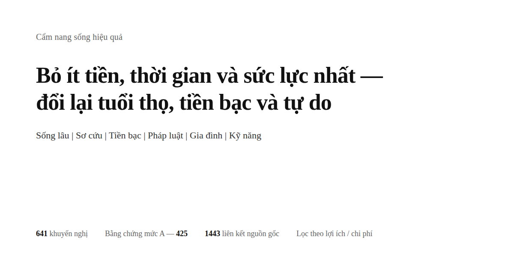

<div align="center">



# Cẩm nang sống hiệu quả

> Bản dịch tiếng Việt không chính thức của [高性价比人生指南](https://github.com/eternity4719/HowToLiveBetter). Khi có khác biệt, bản gốc tiếng Trung là chuẩn.
>
> Bản tiếng Việt bổ sung dòng **Tại Việt Nam** cho từng mục (và phần «Áp dụng tại Việt Nam» cuối các bài đọc dài): đối chiếu luật, thủ tục, số liệu ở Việt Nam. Phần này do người dịch thêm, mang tính tham khảo, không thay thế tư vấn của luật sư hay bác sĩ; hãy kiểm tra văn bản hiện hành.


Nói cách sống lâu hơn, cách ít ốm đau hơn, và khi gặp tai nạn thì cứu giúp thế nào. Nói cách bớt tiêu tiền oan, những việc nào dễ khiến bạn bị lừa đảo hay vướng vào kiện tụng. Nói khi mất việc và không có tiền thì có thể nhận được khoản gì, mở cửa hàng, mở công ty hay làm website cần những thủ tục gì. Cũng nói luôn chuyện yêu đương, kết hôn, sinh con, xuất ngoại và học nghề.<br>
641 lời khuyên, mỗi mục ghi rõ bạn bỏ ra cái gì, đổi lại được cái gì, bằng chứng chắc chắn đến đâu; nguồn trích dẫn chỉ gồm bài báo khoa học trên tạp chí và văn bản chính thức.

Bạn không cần làm hết: đây là danh sách lựa chọn đã xếp sẵn theo độ đáng tiền, không phải danh sách nhiệm vụ — chọn ra một hai mục là đã tính, chính tác giả cũng chưa thực hiện được phần lớn trong số đó.

[](https://hiepnm93.github.io/HowToLiveBetter/vi/)
[](#mục-lục)
[](#phân-hạng-bằng-chứng)
[](docs/research/核实记录/)
[](#giấy-phép)

### [Mở trang tìm kiếm trực tuyến](https://hiepnm93.github.io/HowToLiveBetter/vi/) | [Cho AI trả lời theo sách (skill)](skills/life-decision-guide/README.md)

Skill dành cho trợ lý AI, hỗ trợ cả Claude Code và Codex. Cài xong, bạn cứ hỏi thẳng «có nên đứng bảo lãnh cho bạn mình không», nó sẽ tra các mục trong sách trước rồi mới trả lời, đồng thời chú rõ câu đó rút từ chương nào, mục thứ mấy.

<table>
<tr><td align="right"><b>Tải xuống</b></td><td align="left">

[PDF](https://github.com/hiepnm93/HowToLiveBetter/releases/download/ebooks-latest/HowToLiveBetter-vi.pdf) | [EPUB](https://github.com/hiepnm93/HowToLiveBetter/releases/download/ebooks-latest/HowToLiveBetter-vi.epub)

</td></tr>
<tr><td align="right"><b>Tra cứu</b></td><td align="left">

[Mục lục](#mục-lục) | [Bảng thuật ngữ](#đọc-hiểu-các-con-số-bảng-thuật-ngữ) | [Hồ sơ kiểm chứng](docs/research/核实记录/)

</td></tr>
<tr><td align="right"><b>Bài viết dài</b></td><td align="left">

[Kết hôn có đáng không](docs/research/vi/ket-hon-co-dang-khong.md) | [Danh sách vật dụng khẩn cấp gia đình](docs/research/vi/danh-sach-dung-cu-khan-cap-gia-dinh.md) | [Gặp người lạ gặp nạn có nên dừng lại không](docs/research/vi/gap-nguoi-la-gap-nan-co-nen-dung-lai-khong.md) | [Làm nền tảng cần những giấy phép nào](docs/research/vi/lam-nen-tang-can-nhung-giay-to-gi.md) | [Đồng hồ sinh học và ca đêm](docs/research/vi/dong-ho-sinh-hoc-va-ca-lam-dem.md)

</td></tr>
<tr><td align="right"><b>Công cụ mở rộng</b></td><td align="left">

[howtolivebetter.net](https://howtolivebetter.net/), checklist do [littleben](https://github.com/littleben) làm: thêm việc cần làm, đánh dấu đã làm hay chưa, lưu mục yêu thích

</td></tr>
</table>

<sub>Các công cụ mở rộng do người khác duy trì nên nội dung có thể tụt lại phía sau; hãy lấy nội dung chính của repo này làm chuẩn.</sub>

</div>

| Ngôn ngữ | Trang web | README | PDF | EPUB |
| --- | --- | --- | --- | --- |
| 🇻🇳 Tiếng Việt | [Đọc trên trang web](https://hiepnm93.github.io/HowToLiveBetter/vi/) | [README.vi.md](README.vi.md) | [Tải PDF](https://github.com/hiepnm93/HowToLiveBetter/releases/download/ebooks-latest/HowToLiveBetter-vi.pdf) | [Tải EPUB](https://github.com/hiepnm93/HowToLiveBetter/releases/download/ebooks-latest/HowToLiveBetter-vi.epub) |
| 🇨🇳 Tiếng Trung | [Đọc trên trang web](https://hiepnm93.github.io/HowToLiveBetter/zh/) | [README.zh.md](README.zh.md) | [Tải PDF](https://github.com/hiepnm93/HowToLiveBetter/releases/download/ebooks-latest/HowToLiveBetter-zh.pdf) | [Tải EPUB](https://github.com/hiepnm93/HowToLiveBetter/releases/download/ebooks-latest/HowToLiveBetter-zh.epub) |
| 🇬🇧 Tiếng Anh | [Đọc trên trang web](https://hiepnm93.github.io/HowToLiveBetter/en/) | [README.md](README.md) | [Tải PDF](https://github.com/hiepnm93/HowToLiveBetter/releases/download/ebooks-latest/HowToLiveBetter-en.pdf) | [Tải EPUB](https://github.com/hiepnm93/HowToLiveBetter/releases/download/ebooks-latest/HowToLiveBetter-en.epub) |
| 🇷🇺 Tiếng Nga | [Đọc trên trang web](https://hiepnm93.github.io/HowToLiveBetter/ru/) | [README.ru.md](README.ru.md) | [Tải PDF](https://github.com/hiepnm93/HowToLiveBetter/releases/download/ebooks-latest/HowToLiveBetter-ru.pdf) | [Tải EPUB](https://github.com/hiepnm93/HowToLiveBetter/releases/download/ebooks-latest/HowToLiveBetter-ru.epub) |
| 🇪🇸 Tiếng Tây Ban Nha | [Đọc trên trang web](https://hiepnm93.github.io/HowToLiveBetter/es/) | [README.es.md](README.es.md) | [Tải PDF](https://github.com/hiepnm93/HowToLiveBetter/releases/download/ebooks-latest/HowToLiveBetter-es.pdf) | [Tải EPUB](https://github.com/hiepnm93/HowToLiveBetter/releases/download/ebooks-latest/HowToLiveBetter-es.epub) |
| 🇧🇷 Tiếng Bồ Đào Nha | [Đọc trên trang web](https://hiepnm93.github.io/HowToLiveBetter/pt/) | [README.pt.md](README.pt.md) | [Tải PDF](https://github.com/hiepnm93/HowToLiveBetter/releases/download/ebooks-latest/HowToLiveBetter-pt.pdf) | [Tải EPUB](https://github.com/hiepnm93/HowToLiveBetter/releases/download/ebooks-latest/HowToLiveBetter-pt.epub) |

---

## Những câu hỏi mà cuốn sách này muốn trả lời

| Câu hỏi | Xem ở đâu |
| --- | --- |
| Những việc gì gần như không tốn tiền mà giảm rõ rệt khả năng bạn chết sớm? | [1. Đừng chết sớm](book/vi/01-dung-chet-som.md) |
| Hút thuốc, uống rượu bia, ngồi lâu, thức khuya thực ra làm mất bao nhiêu tuổi thọ; bỏ thuốc và rượu cụ thể thế nào; dầu ăn gia đình chọn và dùng ra sao cho đúng? | [2. Đừng chết từ từ](book/vi/02-dung-chet-tu-tu.md) |
| Mỗi ngày không đủ sức lực, lúc nào cũng bị ngắt quãng, sửa thế nào? | [3. Đừng lãng phí sức lực](book/vi/03-dung-lang-phi-suc-luc.md) |
| Thời gian đi đâu hết, làm sao bớt làm những việc không mang lại lợi ích, trị trì hoãn bằng cách nào? | [4. Đừng lãng phí thời gian](book/vi/04-dung-lang-phi-thoi-gian.md) |
| Tiền dành dụm nên để thế nào để không bị lãi suất, phí và lừa đảo ăn mòn? | [5. Đừng lãng phí tiền](book/vi/05-dung-lang-phi-tien.md) |
| Những thực phẩm chức năng, gói khám sức khỏe, món "thuế IQ" (智商税) nào có thể không mua luôn? | [6. Danh sách cần tránh](book/vi/06-danh-sach-dieu-khong-nen.md) |
| Bạn mất việc, bị nợ lương, túi không còn đồng nào: được lãnh gì, đi đâu nhờ giúp? | [7. Sống thế nào khi không có tiền](book/vi/07-song-the-nao-khi-khong-co-tien.md) |
| Tiền sính lễ (彩礼)， nhà trước hôn nhân, những khoản chuyển tiền lớn thời yêu đương thuộc về ai; khi bị người khác tố cáo hoặc bịa đặt sự việc để tố giác thì bước đầu tiên làm gì; chính mình gây ra chuyện mà tự đến trình bày thì được giảm mấy phần hình phạt; về sau có còn truy cứu và đòi bồi thường được không? | [8. Pháp luật và an toàn tài sản](book/vi/08-dung-tu-dua-minh-vao-rac-roi.md) |
| Những "việc làm thêm" và chuyện vặt tiện tay nào có thể biến người bình thường thành bị cáo trong vụ án hình sự? | [9. Những ranh giới pháp lý người thường dễ vấp](book/vi/09-lan-ranh-phap-luat-de-dam-phai.md) |
| Theo đuổi ai đó nên rải lưới rộng hay cứ bám một người, yêu xa có thành không, đi đăng ký kết hôn cần mang gì? | [10. Yêu và kết hôn có đáng không](book/vi/10-yeu-va-ket-hon-co-dang-khong.md) |
| Viết những loại code nào, nhận những đơn nào có thể bị tuyên án? | [11. Những ranh giới đỏ của lập trình viên và người làm kỹ thuật](book/vi/11-lan-ranh-cho-lap-trinh-vien.md) |
| Trước khi vay tiền mở cửa hàng, mở công ty, điều gì cần nghĩ rõ nhất? | [12. Khởi nghiệp và làm ăn](book/vi/12-khoi-nghiep-va-kinh-doanh.md) |
| Có người ngã xuống ngừng thở, chảy máu ồ ồ, cháy nhà, đi lạc — việc đầu tiên là làm gì? | [13. Tình huống khẩn cấp: làm gì trước](book/vi/13-tinh-huong-khan-cap.md) |
| Tài khoản bị chiếm đoạt, điện thoại bị mất — bước đầu tiên là làm gì? | [14. Tài khoản và an toàn thông tin](book/vi/14-tai-khoan-va-an-toan-thong-tin.md) |
| Tiền cọc bị giữ, chủ nhà đuổi đi, căn hộ cho thuê dài hạn (长租公寓) đổ sụp thì xử lý ra sao; muốn dọn về quê sống thì có được mua nhà nông thôn không? | [15. Thuê nhà và mua nhà](book/vi/15-thue-nha-va-mua-nha.md) |
| Sau khi được chẩn đoán bệnh mạn tính, quản lý lâu dài thế nào và làm sao ít tốn tiền? | [16. Sống thế nào sau khi mắc bệnh mạn tính](book/vi/16-song-khi-mac-benh-man-tinh.md) |
| Giám hộ, di chúc và tiền bạc của người già nên sắp xếp từ trước thế nào? | [17. Nhà có người già](book/vi/17-nha-co-nguoi-gia.md) |
| Sinh con được lãnh những gì, chiếm bao nhiêu thời gian và tiền bạc? | [18. Nuôi con có đáng không](book/vi/18-nuoi-con-co-dang-khong.md) |
| Tiền tăng ca và nghỉ phép năm tính thế nào, bị cho thôi việc được nhận bao nhiêu khoản bồi thường, bị tai nạn lao động thì được xác định và lãnh tiền ra sao? | [19. Đang đi làm, nghỉ việc và tai nạn lao động](book/vi/19-di-lam-nghi-viec-va-tai-nan-lao-dong.md) |
| Trẻ vừa chào đời, vài việc cấp thiết nhất là gì? | [20. Chăm trẻ sơ sinh thế nào](book/vi/20-cham-soc-tre-so-sinh.md) |
| Những nước nào hiện nay đừng đến, khi có chuyện thì đại sứ quán – lãnh sự quán can thiệp đến đâu? | [21. Xuất cảnh, du lịch và an toàn ở nước ngoài](book/vi/21-du-lich-nuoc-ngoai-va-an-toan.md) |
| Đi KTV, quán net, escape room làm sao không dính bẫy, khi căng thẳng nên làm gì hữu ích nhất? | [22. Thư giãn thế nào: nơi giải trí và giảm căng thẳng](book/vi/22-thu-gian-the-nao.md) |
| Học hàn điện, học tiếng Anh, thi lấy chứng chỉ: cái nào thực sự hoàn vốn, học thế nào cho tiết kiệm thời gian, chức danh nghề nghiệp (职称) đăng ký ở đâu và có đáng không? | [23. Học kỹ năng nào là đáng](book/vi/23-hoc-ky-nang-gi-dang.md) |
| Cùng một bệnh, khám ở cơ sở y tế cộng đồng và ở bệnh viện hạng ba (三级医院) chênh nhau bao nhiêu tiền; khi bị thương nặng thì xếp hàng đăng ký khám hay tìm bàn phân loại cấp cứu; chữa xong có cần giám định thương tật, làm thẻ người khuyết tật (残疾人证) không? | [24. Khám chữa bệnh: sao cho ít tốn tiền, ít đi vòng](book/vi/24-di-kham-benh.md) |
| Người thân qua đời, lúc ấy phải làm gì trước, những khoản tiền nào lấy lại được, những khoản phí nào có thể không đóng? | [25. Sau khi người qua đời cần làm gì](book/vi/25-thu-tuc-khi-nguoi-than-qua-doi.md) |
| Muốn làm một website hoặc nền tảng có thu tiền, cần xin những giấy phép nào, đặt máy chủ ở đâu? | [26. Làm một website hoặc nền tảng](book/vi/26-lam-website-hoac-nen-tang.md) |
| Đang mang thai, sắp sinh, thời điểm nào nên làm gì, trước khi xuất viện cần làm những giấy tờ nào? | [27. Mang thai và sinh nở](book/vi/27-mang-thai-va-sinh-con.md) |
| Muốn giảm cân, muốn đẹp hơn, những cách làm nào sẽ hại cơ thể? | [28. Đừng vì ngoại hình mà phá cơ thể](book/vi/28-dung-pha-co-the-vi-ngoai-hinh.md) |
| Người thân qua đời, bị mất việc, nhận chẩn đoán bệnh nặng: mấy tháng đầu điều quan trọng nhất là gì? | [29. Sau biến cố lớn](book/vi/29-sau-cu-soc-lon.md) |
| Con đã đi học, những chuyện về thể chất và tâm lý nào không thể đợi thi xong mới xử lý? | [30. Con sau khi đi học](book/vi/30-con-thoi-di-hoc.md) |
| Sau 18 tuổi, ngoài học hành và đi làm còn có những con đường nào, điều kiện của từng đường là gì? | [31. Sau 18 tuổi còn những con đường nào](book/vi/31-nhung-con-duong-sau-18-tuoi.md) |
| Đi du học, tư cách thị thực (visa) thế nào mới tính là không bị gián đoạn, về nước tấm bằng ấy có được công nhận không? | [32. Du học: tư cách, việc làm thêm, bảo hiểm và công nhận bằng khi về nước](book/vi/32-du-hoc.md) |
| Bạn hoặc người thân bị khuyết tật, trước tiên cần phòng những biến chứng nào, xin được những khoản trợ cấp nào, việc học, việc làm và giám hộ giải quyết thế nào? | [33. Sống thế nào sau khi bị khuyết tật](book/vi/33-song-khi-khuyet-tat.md) |
| Thuốc cảm cúm, thuốc hạ sốt, thuốc dạ dày tự mua về uống: loại nào không được dùng chung, trẻ nhỏ, phụ nữ mang thai và người già cần tránh những loại nào? | [34. Thuốc thường trực trong nhà: đừng để uống ra chuyện](book/vi/34-thuoc-trong-nha-dung-uong-sai.md) |

## Cách đọc

- **Không cần làm hết**: Đây là một danh sách lựa chọn đã xếp theo mức hiệu quả so với chi phí (性价比)， không phải danh sách việc phải làm. Chọn lấy một hai mục là được tính, phần còn lại cứ để đó, khi cần thì quay lại tra tiếp. Nhận xét «nói thì dễ, làm thì khó» là đúng — chính tác giả cũng chưa làm được phần lớn trong số đó, viết ra là để khi cần dùng thì tìm thấy. Muốn chọn cái đỡ tốn công, xem mục «Chỉ muốn xem những việc đáng làm nhất» ở dưới.
- **Muốn nhờ AI tra giúp**: Trong repo có kèm một skill tiếng Trung ([skills/life-decision-guide](skills/life-decision-guide/)), cài được trên cả Claude Code lẫn Codex. Cài xong bạn có thể hỏi thẳng «có nên ký giấy bảo lãnh cho bạn bè không», «hai tiếng đi làm về mỗi ngày có đáng không». Nó sẽ tìm ra trước các mục liên quan trong nội dung sách, rồi trả lời theo thứ tự dựa trên cách tính lợi – hại của sách, và ghi rõ mục đó ở chương nào, mục số mấy. Không tra thấy thì nói không tra thấy, không tự bịa số liệu. Cách cài xem [hướng dẫn trong thư mục đó](skills/life-decision-guide/README.md).
- **Muốn chọn lọc theo điều kiện**: Mở [trang tra cứu trực tuyến](https://hiepnm93.github.io/HowToLiveBetter/vi/), có thể lọc theo từ khóa, chương, mức độ bằng chứng, cũng có thể lọc theo ba tiêu chí «có tốn tiền không, tốn bao nhiêu thời gian, có cần ý chí không», vài điều kiện có thể dùng chồng lên nhau. Nội dung trên trang lấy trực tiếp từ văn bản trong thư mục book/, văn bản sửa chỗ nào thì trang đổi theo chỗ đó.
- **Các mục chỉ dẫn chéo sang nhau** (kiểu «xem chương 8 mục 17»): trên trang tra cứu, chỗ chỉ dẫn này có một đường kẻ nét đứt. Bấm vào là tiêu đề và phần «diễn giải dễ hiểu» (说人话) của mục được chỉ hiện ra ngay tại chỗ. Muốn thực sự nhảy sang thì bấm tiếp «tới mục đó». Nếu mục đó đang bị điều kiện lọc che mất, trang sẽ tự động xóa bộ lọc. Đọc trực tiếp trên GitHub thì không bấm được, nhưng sau mỗi chỗ chỉ dẫn đều ghi rõ nó chỉ tới cái gì («xem mục 18 (vay tiền thì viết giấy nợ cho rõ ràng)»). Không nhảy qua cũng biết đang nói tới mục nào.
- **Muốn đọc theo thứ tự**: Trong mỗi chương, các mục được xếp từ hiệu quả so với chi phí cao xuống thấp, cứ xem từ vài mục đầu của mỗi chương là được.
- **Muốn xem offline hoặc gửi cho người khác**: Tải [bản HTML gộp trong một tệp dùng offline](https://github.com/eternity4719/HowToLiveBetter/releases/download/epub-latest/HowToLiveBetter.html) (bản tiếng Trung), cả quyển sách cùng chức năng tra cứu và lọc đều nằm trong một tệp duy nhất, nhấp đúp là mở, không cần máy chủ cũng không cần mạng, gửi thẳng qua WeChat cũng được.
- **Muốn in hoặc lướt trên điện thoại**: Tải [PDF](https://github.com/hiepnm93/HowToLiveBetter/releases/download/ebooks-latest/HowToLiveBetter-vi.pdf), dàn trang A4, hơn hai trăm trang, có mục lục kèm số trang và dấu trang, mỗi chương bắt đầu ở trang mới.
- **Muốn đọc trên Kindle hoặc máy đọc sách khác**: Tải [e-book EPUB](https://github.com/hiepnm93/HowToLiveBetter/releases/download/ebooks-latest/HowToLiveBetter-vi.epub), với Kindle thì gửi qua Send to Kindle là đọc được.
- **Cả ba tệp đều được tạo lại tự động sau mỗi lần nội dung cập nhật**, đường dẫn tải giữ nguyên không đổi; bản đã chuyển đi sẽ không cập nhật theo, hãy lấy bản trực tuyến làm chuẩn.
- **Không hiểu chuỗi số đó**: Mỗi mục đều có một dòng «diễn giải dễ hiểu». Dòng này chuyển cách viết trong nghiên cứu ở cột «Lợi ích» thành cách nói đời thường như «xác suất tử vong trong cùng thời kỳ thấp hơn chừng 20%», «giam giữ vài ngày, phạt bao nhiêu tiền». Nó chỉ dùng những gì cột «Lợi ích» đã ghi, không thêm số mới. Chỉ cần nhìn dòng này là đủ để quyết định. Cột «Lợi ích» vẫn giữ nguyên toàn bộ số liệu, muốn tự kiểm chứng thì xem cột đó.
- **Chỉ muốn xem kết luận vững nhất**: Trên trang tra cứu, tích chọn mức độ bằng chứng A, sẽ còn lại 425 mục có số cụ thể, đến từ phân tích tổng hợp hoặc thử nghiệm quy mô lớn.
- **Chỉ muốn xem những việc đáng làm nhất**: Tích chọn hiệu quả «cực cao», bạn sẽ có 109 mục không tốn tiền, không tốn thời gian, không cần ý chí mà lợi ích lại thuộc nhóm lớn nhất. Kèm thêm một điều kiện «đổi lại cái gì» là có ngay danh sách ưu tiên theo đúng tiêu chí đó.
- **Thấy tiêu đề chương bắt đầu bằng «đừng» đừng vội lo**: Tiêu đề chương nói về điều chương đó muốn phòng tránh (đừng chết sớm, đừng lãng phí thời gian), không có nghĩa là từng mục bên dưới đều khuyên bạn đừng làm gì đó. Hành động thực sự cần làm nằm trong tiêu đề mục, đều bắt đầu bằng động từ, tự nó đã nói rõ là «làm gì» hay «đừng làm gì». Cùng một chương có cả hai loại: chương 4 vừa có mục «viết 'dự định làm' thành 'mấy giờ, ở đâu, gặp việc gì thì làm việc đó'», vừa có mục «không xem TV và bản tin cuộn liên tục». Hãy đọc theo tiêu đề mục, không cần suy đoán theo giọng điệu của tiêu đề chương.

Mỗi lời khuyên có dạng như sau:

```markdown
### 5. Thay muối ăn trong nhà bằng muối ít natri (muối kali)
- Chi phí: Một gói đắt hơn muối thường vài tệ (元). Mua đồ thì tiện tay thay luôn, không tốn thêm thời gian. Hương vị gần như không đổi.
- Diễn giải dễ hiểu: Trong một thử nghiệm ngẫu nhiên trên hai vạn người, những ai thay muối trong nhà bằng muối ít natri có xác suất tử vong trong vòng năm năm thấp hơn khoảng 12%, đột quỵ thấp hơn khoảng 14%. Con số này đến từ việc so sánh hai nhóm được chia ngẫu nhiên, nên đáng tin hơn số thu được chỉ bằng theo dõi ghi chép.
- Lợi ích: Một thử nghiệm chia người tham gia ngẫu nhiên thành hai nhóm, tiến hành ở nông thôn Trung Quốc, với 20.995 người, đều là người từng bị đột quỵ hoặc bệnh nhân tăng huyết áp trên 60 tuổi, theo dõi trong 4,74 năm. Kết quả: nhóm dùng muối ít natri so với nhóm dùng muối thường có nguy cơ tử vong thấp hơn khoảng 12% (RR 0,88). Đột quỵ thấp hơn khoảng 14% (RR 0,86). Biến cố tim mạch chính thấp hơn khoảng 13% (RR 0,87).
- Mức độ bằng chứng: A
- Nguồn: Neal B 等 (2021). Effect of Salt Substitution on Cardiovascular Events and Death. NEJM. https://doi.org/10.1056/NEJMoa2105675
- Ghi chú: Gây tranh cãi. Đối tượng tham gia thử nghiệm là người cao tuổi có nguy cơ cao, nên lợi ích mà người trẻ khỏe mạnh thu được khi thay muối sẽ nhỏ hơn nhiều. Người có chức năng thận kém, hoặc đang dùng thuốc giữ kali, nên hỏi bác sĩ trước khi thay muối.
```

## Tự chạy một bản

Đa số mọi người không cần tự triển khai: [trang tra cứu trực tuyến](https://hiepnm93.github.io/HowToLiveBetter/vi/) có sẵn, nếu cần dùng offline thì tải [bản HTML một file offline](https://github.com/eternity4719/HowToLiveBetter/releases/download/epub-latest/HowToLiveBetter.html) (bản tiếng Trung), nhấp đúp là mở được.

Nếu bạn thực sự muốn chạy trên máy tính hoặc máy chủ của mình:

```bash
git clone https://github.com/hiepnm93/HowToLiveBetter.git
cd HowToLiveBetter
python -m http.server 8000
```

Sau đó mở `http://localhost:8000/` trong trình duyệt. Trang tra cứu là thuần tĩnh, `README.md` và `book/` chính là dữ liệu của nó — không có backend, không có cơ sở dữ liệu, không cần cài thư viện phụ thuộc; bỏ cả thư mục vào bất kỳ máy chủ tĩnh nào (Nginx, GitHub Pages, lưu trữ đối tượng) thì kết quả cũng như nhau. Lưu ý `index.html` phải được mở qua http, nhấp đúp trực tiếp vào file trên máy sẽ chỉ ra trang trắng — trình duyệt không cho phép trang web đọc file cục bộ, trong trường hợp đó hãy dùng bản HTML một file offline ở trên.

Nếu bạn muốn tự tạo ba bản điện tử (bình thường không cần dùng, bản trong Release cũng là được tạo tự động):

```bash
cd tools/epub && npm ci && npm run build   # EPUB
node tools/offline/build.mjs               # HTML một file offline
node tools/pdf/build.mjs                   # PDF, cần thêm pandoc ≥ 3.1 và typst ≥ 0.13
```

Tất cả sản phẩm đều nằm trong `dist/`.

## Bốn loại tài nguyên

Cuốn sách này muốn giúp bạn giữ lại không chỉ tuổi thọ, mà tổng cộng bốn thứ:

- **Tuổi thọ**: sống lâu hơn, ít chết vì những điều vốn có thể tránh được
- **Thời gian và năng lượng**: thời gian sống không bị đổ vào những việc không có hồi báo, mỗi ngày sự chú ý và thể lực ít bị hao tổn một cách vô ích
- **Tiền bạc**: ít phải tiêu tiền oan, dành tiền cho những chỗ mà lợi ích thu về là chắc chắn
- **Tự do thân thể**: không vì không biết một vạch đỏ nào đó mà tự đưa mình vào trại tạm giữ (拘留所) hay trại tạm giam (看守所)

Mỗi lời khuyên đều trả lời hai câu hỏi: phải bỏ ra cái gì (tiền / thời gian / năng lượng / ý chí), và đổi lại được cái gì (tổng tỷ lệ tử vong thay đổi / giảm một nguyên nhân tử vong cụ thể / tiết kiệm thời gian và năng lượng / tiết kiệm tiền bạc / sự đảm bảo và tự do thân thể). Các mục được sắp theo hiệu quả so với chi phí, không theo chủ đề: cái nào gần như không tốn chi phí gì mà lợi ích thu về lại lớn thì đặt lên đầu.

**Lợi ích của một lời khuyên rơi vào đầu ai — điều này được chia thành các bậc.** Theo mức «lợi ích này sau này có bao nhiêu khả năng quay lại với chính bạn», từ cao xuống thấp: ① **chính bạn**; ② **vợ/chồng và họ hàng trực hệ** (cha mẹ, con cái, ông bà nội ngoại, cháu nội cháu ngoại); ③ **bạn bè, đồng nghiệp và những họ hàng khác** — quan hệ có đi có lại, sự giúp đỡ cho đi sau này có thể quay về; ④ **người lạ** — bậc thấp nhất, nhưng không phải bằng không: khả năng được đền đáp nhỏ, bạn cũng không rõ tính cách của đối phương, còn có mặt bị vu oan để đòi tiền, bị quay lại đổ tội, bị trả thù. Các bậc không gộp chung để tính; khi viết đến bậc ④, lợi ích và rủi ro được nêu cùng nhau.

Phần sơ cấp cứu hãy đọc theo hướng này: trong 38.227 ca ngừng tim ngoài bệnh viện ở Trung Quốc, 79,2% xảy ra tại nhà, nên học ép ngực trước hết là để ép lên chính người thân trong gia đình bạn; những quy tắc kiểu «thấy người đuối nước thì đừng nhảy xuống» hay «trông thấy đánh nhau thì đừng can bằng tay» về bản chất đã là quy tắc tự bảo vệ, nhằm ngăn bạn từ người đứng xem biến thành nạn nhân thứ hai. Có nên ra tay với người lạ hay không là sự cân nhắc của chính bạn; từng mục sẽ ghi rõ điều khoản miễn trừ trách nhiệm, các cử chỉ tự bảo vệ và mặt rủi ro, chứ không thay bạn quy nó thành lý do bắt buộc phải làm.

Số liệu về tỷ lệ tử vong, số liệu về thời gian và năng lượng, số liệu về tiền bạc và hệ quả pháp lý — mỗi loại tính riêng, không quy đổi cho nhau. Bốn thứ này ứng với bốn mục «đổi lại được gì» trên trang tra cứu, và không so lớn nhỏ với nhau.

## Phân hạng bằng chứng

Mỗi lời khuyên đều được ghi rõ mức độ bằng chứng:

| Cấp | Ý nghĩa |
| --- | --- |
| A | Có con số cụ thể để kiểm chứng, xuất phát từ phân tích tổng hợp (meta-analysis) gộp kết quả nhiều nghiên cứu, các nghiên cứu đoàn hệ quy mô lớn theo dõi rất nhiều người trong nhiều năm, hoặc thử nghiệm phân nhóm ngẫu nhiên (RCT); nói được mức giảm cụ thể (HR, RR, phần trăm giảm) |
| B | Có nghiên cứu ủng hộ nhưng không nêu ra được một con số chính xác; hoặc chỉ dựa trên mẫu nhỏ hay một nghiên cứu đơn lẻ |
| C | Kinh nghiệm của chính tác giả, hoặc cách làm được nhiều người công nhận, không có tài liệu nghiên cứu trực tiếp |

Toàn sách gồm 641 mục, trong đó 425 mục hạng A, 165 mục hạng B và 51 mục hạng C; ngoài ra có 60 mục được ghi chú là gây tranh cãi và 2 chỗ được đánh dấu TODO chờ xác minh. Những mục hạng A/B gây tranh cãi sẽ được ghi chú «tranh cãi» kèm bằng chứng từ phía phản đối. Mọi nguồn trích dẫn chỉ dùng tài liệu gốc (bài báo tạp chí kèm DOI hoặc liên kết PubMed, hoặc báo cáo của các cơ quan chính thức như WHO, CDC, Cục Thống kê Quốc gia (国家统计局)), không dùng nguồn chuyển đạt lại từ nơi khác. Con số nào chưa chắc chắn được ghi là «chờ xác minh».

## Xếp loại hiệu quả chi phí

Cấp độ bằng chứng chỉ trả lời câu hỏi «con số này có đáng tin không», chứ không trả lời «việc này có đáng làm không». Vì vậy mỗi mục còn được gán thêm hai nhãn: mức độ lợi ích (lợi ích lớn đến đâu) và thước đo (đổi lấy loại gì). Trang tra cứu lấy hai thứ này cùng với ba loại chi phí, tổng hợp thành một xếp loại hiệu quả chi phí:

| Khía cạnh | Giá trị | Cách xác định |
| --- | --- | --- |
| Thước đo | Đổi lấy tuổi thọ / Đổi lấy tiền / Đổi lấy thời gian – sức lực / Đổi lấy tự do thân thể | Xem mục này chủ yếu đổi lại cái gì. **Không so sánh giữa các thước đo khác nhau**: «tổng tỷ lệ tử vong giảm 12%» và «mỗi năm tiết kiệm 500 nhân dân tệ» không nằm trên cùng một thước đo, không thể phân cao thấp |
| Mức độ lợi ích | Lớn / Trung bình / Nhỏ | Cố lấy theo cột «lợi ích» của chính mục đó, áp vào các ngưỡng đã định sẵn chứ không theo cảm tính: đổi lấy tuổi thọ thì xem tỷ lệ giảm bao nhiêu phần trăm (≥20% là lớn, 10–20% là trung bình, <10% hoặc chỉ đo được chỉ số trung gian mà chưa đo được kết quả cuối cùng là nhỏ); đổi lấy tiền thì xem số tiền (mức hàng vạn tệ là lớn, vài trăm đến vài nghìn là trung bình, vài chục tệ là nhỏ); đổi lấy tự do thân thể thì xem hậu quả (tránh trách nhiệm hình sự là lớn, tránh giam giữ hoặc xử phạt hành chính là trung bình, tránh tranh chấp dân sự là nhỏ); đổi lấy thời gian – sức lực thì xem tiết kiệm được bao nhiêu (tiết kiệm được vài giờ mỗi ngày là lớn, vài giờ mỗi tuần là trung bình, chỉ tiết kiệm cho một lần là nhỏ) |
| Hiệu quả chi phí | Cực cao / Cao / Trung bình | Lợi ích lớn mà cả ba loại chi phí đều bằng không = cực cao; lợi ích lớn, chi phí không cao, hoặc lợi ích trung bình, chi phí bằng không = cao; còn lại = trung bình |

Trong 641 mục của cả sách, 109 mục (17%) có hiệu quả chi phí cực cao, 292 mục (46%) ở mức cao và 240 mục (37%) ở mức trung bình. Việc mức ở giữa có nhiều mục là có chủ ý: mức độ lợi ích ở bên dưới vốn chỉ chia thành ba cấp lớn, trung bình, nhỏ; cắt nhỏ hơn nữa chỉ là độ chính xác giả tạo.

**Xếp loại này là phán đoán của chính tác giả, không phải bằng chứng**; theo tiêu chuẩn của cuốn sách thì bản thân nó chỉ tính là cấp C. Nó và cấp độ bằng chứng là hai chuyện khác nhau, bên nào cũng không ảnh hưởng bên nào. Một mục có thể có bằng chứng cấp A nhưng hiệu quả chi phí chỉ ở mức trung bình (vaccine zona có RCT giai đoạn III cho hiệu lực 97,2%, nhưng hai mũi tiêm tốn ba đến bốn nghìn tệ, trong khi zona rất hiếm khi gây tử vong), cũng có thể chỉ có bằng chứng cấp C nhưng hiệu quả chi phí lại cực cao (gửi lịch trình chuyến đi cho người thân trước khi xuất cảnh). «Trung bình» không có nghĩa là không nên làm — mọi mục trong sách đều là việc nên làm, chỉ là ở mức này bạn phải tự cân nhắc xem khoản chi đó có đáng hay không.

## Đọc hiểu các con số (Bảng thuật ngữ)

Phần nội dung chính cố gắng dùng lối nói đời thường, nhưng khi trích dẫn nghiên cứu thì khó tránh khỏi vài danh từ thống kê. Đọc không hiểu thì tra bảng này; ở trang tra cứu trực tuyến, rê chuột lên từ có gạch chân nét đứt (trên điện thoại thì chạm vào một cái) cũng sẽ hiện ra phần giải thích.

<details>
<summary>Mở rộng 41 thuật ngữ (tỷ lệ tử vong toàn nguyên nhân, HR, RR, 95% CI, phân tích tổng hợp, BMI, LPR, đặt cọc và đặt trước...)</summary>

| Thuật ngữ | Ý nghĩa |
| --- | --- |
| Tỷ lệ tử vong toàn nguyên nhân | Trong một khoảng thời gian, số người chết trong một nhóm người chiếm bao nhiêu phần trăm, bất kể chết vì nguyên nhân gì. Cuốn sách này dùng nó để đo «sống được lâu hay không». Trong nghiên cứu gốc gọi là tử vong toàn nguyên nhân (all-cause mortality), viết tắt tiếng Anh là ACM |
| HR | Tỷ số nguy cơ (hazard ratio). Trong cùng một khoảng thời gian, lấy tốc độ xảy ra sự cố (chết, mắc bệnh) của nhóm làm việc đó chia cho nhóm không làm. HR 0,87 nghĩa là thấp hơn nhóm không làm 13%, HR 1,21 nghĩa là cao hơn 21% |
| RR | Rủi ro tương đối (relative risk). Tỷ số giữa khả năng xảy ra sự cố của hai nhóm người, cách đọc số giống HR |
| OR | Tỷ số chênh (odds ratio). Cũng là so sánh giữa hai nhóm, chỉ khác cách tính với RR đôi chút: khi sự việc cần so sánh hiếm gặp thì nó gần bằng RR; khi sự việc rất phổ biến thì nó sẽ nói khoảng chênh lệch lớn hơn thực tế |
| IRR | Tỷ suất mắc mới (incidence rate ratio). Tỷ suất mắc là tỷ lệ người mới mắc bệnh trong một khoảng thời gian chiếm bao nhiêu, lấy hai nhóm chia cho nhau, cách đọc giống RR |
| RaR | Tỷ số số lần xảy ra (rate ratio). So sánh số lần sự việc xảy ra (ví dụ ngã bao nhiêu lần), chứ không phải bao nhiêu người gặp sự cố, cách đọc giống RR |
| Tỷ lệ tử vong chuẩn hóa | Viết tắt tiếng Anh là SMR. Số người thực tế đã chết trong nhóm này, chia cho «số người bình thường cùng độ tuổi lẽ ra phải chết». 5,86 nghĩa là số người chết gấp 5,86 lần người cùng tuổi |
| Chênh lệch rủi ro | Lấy xác suất xảy ra sự cố của nhóm này trừ nhóm kia, cho ra trực tiếp «mỗi 1.000 người thì nhiều thêm mấy người». Con số gấp bội chỉ nói được gấp mấy lần, còn chênh lệch rủi ro nói lên thực chất nhiều thêm bao nhiêu người |
| 95% CI | Khoảng tin cậy 95%. Con số tính ra từ nghiên cứu luôn có sai số, đây là khoảng mà thực tế rất có thể rơi vào. Với con số dạng gấp bội, nếu khoảng này vượt qua 1; với con số dạng cộng trừ, nếu khoảng vượt qua 0, thì nghĩa là sự khác biệt giữa hai nhóm có thể chỉ do ngẫu nhiên, trong bài sẽ ghi «không có ý nghĩa thống kê» |
| RCT | Thử nghiệm đối chứng ngẫu nhiên. Dùng cách bốc thăm để chia người thành hai nhóm, một nhóm làm việc đó, một nhóm không làm, sau đó so sánh kết quả chênh nhau bao nhiêu. Để chứng minh «chính việc đó mới là thứ phát huy tác dụng», cách làm này có sức thuyết phục nhất |
| Phân tích tổng hợp | Gộp kết quả của nhiều nghiên cứu vào rồi tính lại, cho ra một con số tổng thể. Còn gọi là phân tích meta (meta-analysis) |
| Đoàn hệ | Nghiên cứu đoàn hệ (cohort). Chọn một nhóm đông người theo dõi nhiều năm, ghi lại ai gặp sự cố. Có thể thấy hai việc thường xuất hiện cùng nhau, nhưng chưa đủ để chứng minh việc trước gây ra việc sau |
| Quan sát | Nghiên cứu quan sát (observational). Người nghiên cứu chỉ đứng bên ghi chép, không sắp đặt ai làm, ai không làm. Kết quả dễ bị các yếu tố khác làm lệch (xem hai mục «nhiễu» và «nhân quả ngược» trong bảng này), con số cần xem một cách dè dặt hơn |
| Nhiễu | Có một yếu tố thứ ba cùng lúc tác động đến cả nguyên nhân lẫn kết quả, khiến hai việc trông như có quan hệ nhân quả. Ví dụ người thích ăn rau thường cũng thích vận động hơn, không phân biệt được yếu tố nào đang phát huy tác dụng |
| Nhân quả ngược | Hướng của nhân quả bị đảo ngược: nhìn có vẻ việc trước gây ra việc sau, nhưng thực ra là việc sau gây ra việc trước. Không phải ngủ nhiều khiến người ta chết sớm, mà là người bệnh nặng ngủ nhiều |
| d, g | Cỡ hiệu ứng (effect size), thể hiện khoảng cách giữa hai nhóm lớn bao nhiêu. Quy khoảng cách thành «tương đương mấy lần biên độ dao động thường gặp»: 0,2 tính là nhỏ, 0,5 trung bình, 0,8 lớn |
| r | Hệ số tương quan. Mức độ hai việc biến đổi cùng nhau có chặt chẽ hay không, giá trị từ -1 đến 1: 0,1 tính là yếu, 0,3 trung bình, 0,5 tính là mạnh |
| MET | Đơn vị đo cường độ vận động. Ngồi yên là 1 MET, đi bộ nhanh khoảng 3 đến 4 MET. Viết MET·h nghĩa là cường độ nhân với số giờ thực hiện, thể hiện tổng lượng vận động là bao nhiêu |
| GRADE | Một hệ thống chấm điểm thông dụng trên quốc tế, xếp hạng một bằng chứng đáng tin đến mức nào, chia thành bốn mức: cao, trung bình, thấp, rất thấp |
| Phân tích theo ý định sàng lọc | Khi tính hiệu quả, tính theo «đã thông báo ai đi sàng lọc», không tính theo «ai thực sự đi làm». Trong số người được thông báo luôn có người không đi, nên cách tính này sẽ tính thấp lợi ích của sàng lọc đối với những người thực sự đi làm |
| Gói-năm | Đơn vị thống kê tổng số thuốc lá một người đã hút. Số gói hút mỗi ngày nhân với số năm đã hút, 30 gói-năm nghĩa là mỗi ngày một gói trong 30 năm |
| BMI | Chỉ số khối cơ thể, con số thường dùng để đánh giá gầy béo: số cân nặng tính bằng ki-lô-gam chia cho bình phương chiều cao tính bằng mét |
| LDL | Cholesterol lipoprotein tỷ trọng thấp, còn gọi nôm na là cholesterol xấu |
| eGFR | Tốc độ lọc cầu thận ước tính, một chỉ số đo lường khả năng lọc của thận, đơn vị mL/phút/1,73 m². Số càng thấp chứng tỏ chức năng thận càng kém, việc chia bệnh thận mạn tính thành các giai đoạn cũng căn cứ vào nó |
| HBsAg | Kháng nguyên bề mặt viêm gan B, một mục trên phiếu xét nghiệm. Kết quả dương tính nghĩa là đã nhiễm virus viêm gan B |
| HPV | Virus u nhú ở người. Virus này có nhiều type, trong đó một số type nếu nhiễm kéo dài sẽ gây ung thư cổ tử cung |
| LDCT | Chụp cắt lớp ngực liều thấp, lượng phóng xạ bằng khoảng một phần năm đến một phần mười so với CT thường |
| PM2.5 | Bụi mịn lơ lửng trong không khí, đường kính dưới 2,5 micromet |
| NOVA | Một cách phân loại thực phẩm, chia thành bốn nhóm theo mức độ chế biến sâu, «thực phẩm siêu chế biến» là nhóm thứ tư trong đó |
| LPR | Lãi suất tham chiếu thị trường cho vay (贷款市场报价利率， Loan Prime Rate). Lãi suất cơ chuẩn cho vay trong nước, công bố một lần vào ngày 20 hằng tháng, lãi suất vay mua nhà và mức trần lãi suất cho vay dân gian đều tính theo nó |
| Một lần trọng tài là chung thẩm (一裁终局) | Kết quả trọng tài lao động ban hành là có hiệu lực ngay, bên sử dụng lao động không thể đem vụ việc này ra tòa kiện nữa |
| Tỷ lệ kết hôn thô, tỷ lệ ly hôn thô | Mỗi 1.000 người có bao nhiêu cặp đăng ký kết hôn, đăng ký ly hôn trong năm. Ngoài ra còn một con số gọi là tỷ lệ ly hôn trên kết hôn (离结比)， là số cặp ly hôn trong năm chia cho số cặp kết hôn, không phải một chuyện với hai chỉ số này, đừng xem lẫn lộn |
| AED | Máy khử rung tim tự động ngoài cơ thể. Cái hộp cấp cứu màu đỏ hoặc vàng thường thấy ở nơi công cộng, sau khi bật máy chỉ cần làm theo hướng dẫn bằng giọng nói, có cần sốc điện hay không do máy tự đánh giá |
| CPR | Hồi sinh tim phổi. Khi tim ngừng đập, ấn mạnh vào ngực để máu tiếp tục lưu thông |
| Chứng nhận 3C | Chứng nhận sản phẩm bắt buộc của Trung Quốc (中国强制性产品认证). Những sản phẩm nằm trong danh mục mà không in dấu hiệu này thì không được phép xuất xưởng, không được phép bán |
| Đăng ký ICP (ICP 备案) | Trước khi trang web hoặc App chính thức vận hành, phải làm một thủ tục đăng ký trong hệ thống của Bộ Công nghiệp và Công nghệ thông tin (工信部) |
| Bảo vệ theo cấp độ | Chế độ bảo vệ an ninh mạng theo cấp độ (网络安全等级保护制度). Căn cứ mức độ quan trọng của một hệ thống mà chia thành vài cấp độ, cấp độ càng cao thì các biện pháp an ninh phải làm càng nhiều |
| GPL | Một loại giấy phép mã nguồn mở. Những sản phẩm làm ra từ loại mã nguồn này, khi phát hành ra ngoài thường cũng phải công khai luôn mã nguồn của mình |
| Ràng buộc không cạnh tranh (竞业限制) | Một thỏa thuận ký với công ty: trong một khoảng thời gian sau khi nghỉ việc không đi làm cho đối thủ cùng ngành. Trong thời gian đó công ty phải trả cho bạn khoản bù đắp hằng tháng, tối đa 2 năm |
| Vốn góp cam kết (认缴出资) | Số tiền hứa sẽ bỏ vào khi đăng ký thành lập công ty. Đã cam kết thì phải thực sự đóng trong thời hạn pháp luật quy định, chứ không phải viết một con số cho đẹp |
| Đặt cọc (定金) và đặt trước (订金) | Hai chữ chỉ khác nhau một chữ mà hiệu lực chênh nhau rất nhiều: tiền đặt cọc (定金) có chế tài phạt, bên nhận tiền mà đổi ý thì phải hoàn lại gấp đôi, số tiền tối đa bằng 20% giá trị hợp đồng; tiền đặt trước (订金) chỉ là khoản trả trước, đổi ý thì không chịu chế tài này |

</details>

## Mục lục

1. [Đừng chết sớm](book/vi/01-dung-chet-som.md)：tử vong do nguyên nhân bên ngoài, khí gas và ngộ độc, vắc-xin, tầm soát bệnh, khủng hoảng tâm lý và thang thời gian của ý định tự sát, những gì còn lại sau khi được cứu sống, chặng một năm sau chấn thương nặng do ngã, bài toán quả thận còn lại sau khi bán đi một quả thận, trang bị khẩn cấp gia đình, các dấu hiệu cần đi khám như tiểu ra máu nhìn thấy bằng mắt thường. Thước đo: tổng tỷ lệ tử vong hoặc nguyên nhân tử vong cụ thể.
2. [Đừng chết dần](book/vi/02-dung-chet-tu-tu.md)：thuốc lá và rượu bia, vận động, giấc ngủ, ăn uống (muối giảm natri, các loại hạt, ngũ cốc nguyên hạt, thịt chế biến sẵn, dầu đậu phộng tự ép mua rời, dầu thực vật thay mỡ heo), ngồi nhiều, cùng các cách cụ thể để bỏ thuốc và bỏ rượu (thuốc cai thuốc lá, chọn ngày cai, phòng khám và đường dây nóng cai thuốc, thuốc lá điện tử, hội chứng cai rượu không nên tự gồng qua), thời lượng ngủ trưa, cách bù sau khi thức khuya, bài toán số năm làm ca đêm. Thước đo: tổng tỷ lệ tử vong hoặc nguyên nhân tử vong cụ thể. Bài dài xem [docs/生物钟和夜班.md](docs/research/vi/dong-ho-sinh-hoc-va-ca-lam-dem.md).
3. [Đừng lãng phí năng lượng](book/vi/03-dung-lang-phi-suc-luc.md)：giấc ngủ, bị ngắt quãng, đa nhiệm, mệt mỏi do ra quyết định, gánh nặng ân tình, kỳ vọng hợp lý khi làm việc với các cơ quan. Thước đo: năng lượng/thời gian.
4. [Đừng lãng phí thời gian](book/vi/04-dung-lang-phi-thoi-gian.md)：những việc không mang lại lợi ích, chi phí chìm, trì hoãn (giải thích bằng cảm xúc, thay đổi môi trường, cơ chế ràng buộc cam kết, thói quen cần bao lâu để hình thành, tài liệu tự áp dụng), họp hành, đi lại giữa nhà và chỗ làm. Thước đo: thời gian.
5. [Đừng lãng phí tiền](book/vi/05-dung-lang-phi-tien.md)：thuê bao, vé số, tiền lãi, bảo hiểm, phí quỹ đầu tư, chương trình hưu cá nhân (个人养老金)， bảo hiểm xe, trả trước, mua sắm qua livestream, tài khoản cá nhân của bảo hiểm y tế (医保个人账户)， con bị lừa và hoàn tiền nạp game, vòng tay - đồng hồ hiệu - đồ chơi săn lùng không tính là đầu tư, cách kiểm tra giấy kiểm định trang sức và ngọc thạch, mở hộp mù và quay thẻ, muốn mua tài sản ở nước ngoài thì đi kênh hợp pháp nào; sáu mục cuối nói về bảo hiểm: chỉ mua cho tổn thất mình không gánh nổi, người trụ cột kiếm tiền mua bảo hiểm tử kỳ trước, hủy hợp đồng trong thời gian cân nhắc, ở quầy ngân hàng đừng nhầm bảo hiểm với tiền gửi tiết kiệm, đừng tìm đơn vị môi giới hủy bảo hiểm hộ, người thụ hưởng và thời hiệu yêu cầu bồi thường. Thước đo: tiền bạc.
6. [Danh sách phản ví dụ](book/vi/06-danh-sach-dieu-khong-nen.md)：những thứ trông đáng tiền nhưng thực ra không, kể cả cách nói «ý chí sẽ cạn kiệt».
7. [Sống sao khi không có tiền](book/vi/07-song-the-nao-khi-khong-co-tien.md)：cứu trợ, trợ cấp, tìm việc, ăn ở, y tế, đòi lương bị nợ, tránh bẫy. Thước đo: tiền bạc/chế độ bảo đảm.
8. [Đừng để bản thân dính vào: pháp luật và an toàn tài sản](book/vi/08-dung-tu-dua-minh-vao-rac-roi.md)：tai nạn giao thông, tạm khóa thanh toán khi bị lừa, AI thay mặt và giả giọng nói, tự thú và khai báo trung thực giảm được bao nhiêu hình phạt cùng vì sao con đường «trốn qua thời hiệu truy cứu» không đi được, những hướng đi sau khi bị buộc tội hoặc bị người khác bịa chuyện tố cáo, ranh giới giữa việc dọa tố cáo để ép đối phương đưa tiền với việc yêu cầu bồi thường chính đáng của mình, xung đột và bạo lực cực đoan để trút giận, cơn thôi thúc gây thương tích và quyền của người bên cạnh đưa đi khám tâm thần, bốn chốt pháp lý khi đã mua bảo hiểm cho người thân rồi ra tay hại, cách nhờ nền tảng và lệnh cấm sau khi bị công kích trên mạng, tiền sính lễ (彩礼)， tài sản trước hôn nhân, bảo lãnh, nhận diện lừa đảo, thời hiệu khởi kiện, bị thi hành án và danh sách thất tín, trách nhiệm nuôi chó, biên nhận tiếp nhận trình báo sau khi báo công an và cách phản đối khi không khởi tố, còn đưa tiền để «xong chuyện» là phạm tội hối lộ. Thước đo: tiền bạc/tự do cá nhân.
9. [Lằn ranh pháp luật người thường dễ vấp phải](book/vi/09-lan-ranh-phap-luat-de-dam-phai.md)：tin giả, xúc phạm anh hùng liệt sĩ, nội dung nước ngoài chỉ xem không chia sẻ, phát tán khiêu dâm, rửa tiền làm thêm, làm giả hồ sơ để lừa vay, dựng tai nạn giả để lừa bảo hiểm, ném đồ từ trên cao xuống, súng mô phỏng, máy bay không người lái, quay lén, ranh giới giữa cho con nuôi hợp pháp khi không nuôi nổi với mua bán và bỏ rơi trẻ em, cờ bạc, thịt động vật hoang dã, bán nội tạng và giúp tìm người hiến. Thước đo: tự do cá nhân/tiền bạc.
10. [Yêu và kết hôn có đáng không](book/vi/10-yeu-va-ket-hon-co-dang-khong.md)：chiến lược chọn bạn đời, lằn ranh khi níu kéo, tín hiệu quan tâm, chất lượng mối quan hệ, yêu xa, thủ tục đăng ký, khám tiền hôn nhân, bài toán sức khỏe, bài toán thời gian, bài toán tiền bạc, cha mẹ bỏ tiền mua nhà và nợ chung vợ chồng, chi phí rút lui. Bài dài xem [docs/结婚划不划算.md](docs/research/vi/ket-hon-co-dang-khong.md).
11. [Lằn ranh dân lập trình và dân kỹ thuật dễ vấp phải](book/vi/11-lan-ranh-cho-lap-trinh-vien.md)：gian lận game (外挂)， thu thập dữ liệu tự động (crawler), kịch bản săn vé, xóa sạch dữ liệu, mang mã nguồn ra đi, nhận viết phần mềm thuê, điều khoản không cạnh tranh, giấy phép mã nguồn mở, thủ tục khai báo (备案). Thước đo: tự do cá nhân/tiền bạc.
12. [Khởi nghiệp và kinh doanh: đừng đánh mất cả gia sản](book/vi/12-khoi-nghiep-va-kinh-doanh.md)：vốn liếng, bảo lãnh, chọn loại hình chủ thể, đăng ký kinh doanh, giấy phép, kê khai thuế, hóa đơn, lừa đảo mạo danh cơ quan thuế, hợp đồng, thuê người, sản xuất hàng loạt, lằn ranh sở hữu trí tuệ khi nhập hàng và dùng hình ảnh, cách rút lui. Thước đo: tiền bạc/trách nhiệm pháp lý.
13. [Tình huống khẩn cấp: làm gì trước](book/vi/13-tinh-huong-khan-cap.md)：ngừng tim, đột quỵ và đột quỵ vòng tuần hoàn sau, đột quỵ mắt, nhồi máu cơ tim, bóc tách động mạch chủ, đau đầu như sét đánh, tụ máu dưới màng cứng mạn tính, thuyên tắc phổi, mất máu nhiều, vết cắn, bỏng, sốc phản vệ, động kinh, hạ đường huyết, điện giật, nhiễm khí CO, nuốt nhầm chất và bỏng hóa chất, dị vật cắm vào người, cố định xương gãy, lừa đảo, đe dọa quyền riêng tư, say nắng, cháy, đuối nước, lạc đường, hạ thân nhiệt, rắn cắn, động đất, thú dữ, sét đánh, bệnh cao nguyên, bọ ve, nước uống ngoài trời hoang dã; cùng phần «cứu rồi gánh nổi không»: người già ngã thì đỡ thế nào, gặp ẩu đả giữa đường thì xử ra sao, cứu người mà mình bị thương thì tiền ở đâu. Thước đo: tỷ lệ sống sót và tiền bạc, vài mục cuối chạm đến tự do cá nhân.
14. [An toàn tài khoản và thông tin](book/vi/14-tai-khoan-va-an-toan-thong-tin.md)：xác thực hai lớp, mật khẩu, thẻ SIM, mất điện thoại, kẻ gian rút tiền thẻ ngân hàng, thiết bị đăng nhập, quyền của App, nhận diện khuôn mặt, quyền tra cứu và xóa dữ liệu. Thước đo: tiền bạc/thông tin cá nhân.
15. [Thuê nhà và mua nhà](book/vi/15-thue-nha-va-mua-nha.md)：tiền cọc, ép dọn đi bằng vũ lực, môi giới thay thu tiền, giám sát dòng tiền giao dịch, bán nhà không làm mất hiệu lực hợp đồng thuê, kiểm tra quyền sở hữu, tài khoản chuyên dụng cho tiền giao dịch, phòng chia ngăn, hộ khẩu thành thị thì đừng mua đất thổ cư nông thôn (宅基地) mà chỉ nên thuê nhà dân. Thước đo: tiền bạc.
16. [Sống sau khi mắc bệnh mạn tính](book/vi/16-song-khi-mac-benh-man-tinh.md)：dùng thuốc đều đúng chỉ định, thanh toán ngoại trú bệnh mạn tính liên tỉnh, hồ sơ tái khám, đừng ngừng thuốc thử bài dân gian, đơn thuốc dài hạn, ký hợp đồng bác sĩ gia đình, tầm soát biến chứng, phòng sỏi thận tái phát, điều trị gout đạt mục tiêu. Thước đo: tổng tỷ lệ tử vong/tiền bạc.
17. [Nhà có người già](book/vi/17-nha-co-nguoi-gia.md)：giám hộ theo ủy ý (意定监护)， hình thức di chúc, tài khoản và chiêu trò lừa, lừa đảo đầu tư an dưỡng và thế chấp nhà đổi tiền về già (以房养老)， bảo hiểm chăm sóc dài hạn, phòng loét do nằm lâu. Thước đo: tiền bạc/tự do cá nhân, mục loét nằm lâu tính theo tỷ lệ tử vong.
18. [Nuôi con có đáng không](book/vi/18-nuoi-con-co-dang-khong.md)：trợ cấp nuôi con, nghỉ thai sản và phụ cấp sinh con, chế độ bảo hộ «ba giai đoạn» (三期: mang thai, sinh nở, cho con bú), bài toán thời gian, bài toán tiền bạc. Thước đo: tiền bạc/thời gian.
19. [Đang đi làm, nghỉ việc và tai nạn lao động](book/vi/19-di-lam-nghi-viec-va-tai-nan-lao-dong.md)：tiền làm thêm giờ, nghỉ phép năm, thử việc; thông báo nguy cơ bệnh nghề nghiệp và ba lần khám sức khỏe, phòng bụi và ồn; N, tiền báo trước thay thế, 2N, đừng ký đơn xin nghỉ việc tự nguyện, giữ bằng chứng; thời hạn xác định tai nạn lao động, công ty không đóng bảo hiểm, giám định khả năng lao động, chế độ khi tử vong do lao động. Thước đo: tiền bạc.
20. [Chăm sóc trẻ vừa mới sinh](book/vi/20-cham-soc-tre-so-sinh.md)：ngủ an toàn, mũi viêm gan B đầu tiên, vắc-xin theo chương trình miễn dịch quốc gia (免疫规划疫苗)， sữa mẹ và thức ăn dặm, nhiệt độ pha sữa, mật ong, vitamin K, ngưỡng sốt phải đi viện, đừng lắc trẻ, tã và các món mua giá trị lớn, cho trẻ nhóm nguy cơ cao ăn đậu phộng sớm để phòng dị ứng. Thước đo: tỷ lệ tử vong trẻ sơ sinh/tiền bạc.
21. [Xuất cảnh, du lịch và an toàn ở nước ngoài](book/vi/21-du-lich-nuoc-ngoai-va-an-toan.md)：cấp độ cảnh báo an toàn, đường dây nóng 12308, giới hạn của bảo hộ lãnh sự, bảo hiểm y tế ở nước ngoài, lừa đảo tuyển dụng lương cao ở nước ngoài, hạn mức rút tiền mặt mỗi năm ở nước ngoài, mất giấy tờ, bằng lái xe ở nước ngoài, khai báo của công ty môi giới. Thước đo: tiền bạc/tự do cá nhân.
22. [Nghỉ ngơi thế nào: nơi giải trí và giảm áp lực](book/vi/22-thu-gian-the-nao.md)：lối thoát hiểm, giá niêm yết rõ ràng, lằn ranh ma túy, đồ người khác đưa, dùng tên thật ở quán net, chọn địa điểm chơi escape room và game phá án; vận động, chánh niệm, hô hấp, giao tiếp, không gian xanh. Thước đo: tiền bạc/tự do cá nhân, cùng năng lượng/tổng tỷ lệ tử vong.
23. [Học kỹ năng gì thì đáng](book/vi/23-hoc-ky-nang-gi-dang.md)：học tiếp hay đi làm (ngưỡng tuổi lao động trẻ, giáo dục và tỷ lệ tử vong, cơ cấu trình độ học vấn toàn quốc, miễn học phí với học bổng và vay học tập, con đường lên đại học từ dạy nghề trung cấp, cách tự tính bài toán này), suất lợi ích của giáo dục, bằng cấp giả mạo, trợ cấp đào tạo, kỹ năng nào khó bị máy thay, bậc kỹ năng, cách tra ngành nghề thiếu hụt; cùng học thế nào sau khi đã chọn xong (tự kiểm tra, luyện tập giãn cách, đừng dựa vào tô đậm nội dung, luyện xen kẽ, «phong cách học» không có bằng chứng); cuối cùng là chức danh chuyên môn (kênh nộp hồ sơ, thi thay thẩm định, hậu quả của thẩm định giả, được công nhận chưa chắc được tuyển vào vị trí). Thước đo: tiền bạc/thời gian, một mục tính theo tỷ lệ tử vong.
24. [Đi khám bệnh: ít tốn tiền, ít đi đường vòng](book/vi/24-di-kham-benh.md)：khám theo tuyến và chuyển tuyến, cách tính liền mạch của ngưỡng tự trả ban đầu (起付线)， chênh lệch tỷ lệ chi trả bảo hiểm, nguồn số khám để dành, đánh giá mức cần thiết khi khám chữa bệnh khác tỉnh, giữ và niêm phong hồ sơ bệnh án, thứ tự bốn mức phân loại cấp cứu, trợ giúp cấp cứu bệnh tật khi không đủ tiền trả, thời điểm làm giám định thương tật, cách làm thẻ người khuyết tật, không cần biếu bác sĩ phong bì. Thước đo: tiền bạc/thời gian.
25. [Người mất rồi cần làm những gì](book/vi/25-thu-tuc-khi-nguoi-than-qua-doi.md)：báo công an và giấy chứng tử, đưa thi thể và hỏa táng, nghi ngờ nguyên nhân tử vong và khám nghiệm tử thi, xóa hộ khẩu, danh mục dịch vụ tang lễ cơ bản, vi phạm giá, đăng ký của dịch vụ môi giới, số dư quỹ nhà ở (公积金) và chế độ an sinh, quyền thông tin cá nhân của người đã mất. Thước đo: tiền bạc.
26. [Làm một website hoặc nền tảng: giấy phép, khai báo và máy chủ](book/vi/26-lam-website-hoac-nen-tang.md)：lằn ranh pháp lý khi thay nền tảng thu chi hộ， giấy phép và khai báo ICP (ICP备案)， giấy phép phát trực tiếp và phát thanh-truyền hình， xác thực người dùng và báo cáo thuế của nền tảng， quản trị nội dung， tên thật， người chưa thành niên， thông báo-xóa， chuyển dữ liệu ra nước ngoài， chọn máy chủ. Thước đo: tự do cá nhân/tiền bạc. Bài dài xem [docs/做平台要办哪些证.md](docs/research/vi/lam-nen-tang-can-nhung-giay-to-gi.md).
27. [Mang thai và sinh nở: từ lúc phát hiện có thai đến khi xuất viện làm giấy tờ](book/vi/27-mang-thai-va-sinh-con.md)：acid folic, lập sổ theo dõi thai và khám thai miễn phí, sàng lọc ba bệnh và chặn lây từ mẹ sang con, thuốc lá rượu bia khi mang thai, aspirin liều thấp và đái tháo đường thai kỳ, dấu hiệu phải đến viện ngay, xử lý khi ối vỡ, giảm đau khi sinh, chỉ định mổ lấy thai, bảo hiểm sinh sản, giấy chứng sinh (出生医学证明)， sàng lọc trẻ sơ sinh， tham gia bảo hiểm và đăng ký hộ khẩu, tái khám 42 ngày sau sinh. Thước đo: tỷ lệ tử vong và tiền bạc.
28. [Đừng phá sức khỏe vì ngoại hình](book/vi/28-dung-pha-co-the-vi-ngoai-hinh.md)：nhịn ăn cực đoan và rối loạn ăn uống, hai giấy phép của cơ sở thẩm mỹ y khoa và bác sĩ phụ trách chính, vùng tiêm đầy mặt có nguy cơ mù lòa, sản phẩm giảm béo thêm trái phép sibutramine, steroid đồng hóa, thuốc giảm béo và hormone giới tính cần đơn thuốc cùng tái khám định kỳ, đánh giá rối loạn hình ảnh cơ thể. Thước đo: tỷ lệ tử vong (điểm cuối sức khỏe), hai mục thẩm mỹ y khoa chạm thêm tự do cá nhân.
29. [Sau những cú sốc lớn](book/vi/29-sau-cu-soc-lon.md)：cửa sổ nguy cơ tim mạch trong tháng đầu mất người thân, tuần đầu sau khi được chẩn đoán bệnh nặng, mất việc, nửa năm sau khi bạn đời qua đời, mất người thân do tự sát, không còn người thân lẫn bạn bè thì tìm «người đó» thay thế thế nào, trẻ em mất cha mẹ, nỗi buồn bị kẹt lại thì đăng ký khám ở đâu, ly hôn, đường dây nóng 12356 và 12355, đừng đưa ra quyết định không thể đảo ngược trong thời kỳ stress cấp, và con đường «chết để trả nợ» không thông. Thước đo: tổng tỷ lệ tử vong, bốn mục nói về chi tiêu và chế độ tính theo tiền bạc.
30. [Trẻ sau khi vào trường học](book/vi/30-con-thoi-di-hoc.md)：cấp tính tính theo giờ, đừng trì hoãn điều trị vì thi cử, bị bắt nạt thì làm gì, 2 giờ ngoài trời mỗi ngày, phiếu khám sức khỏe học sinh, tầm soát trầm cảm tuổi thiếu niên, sản phẩm quảng cáo «chữa khỏi cận thị», quy định cứng về giấc ngủ và bài tập về nhà, nghỉ học bảo lưu tư cách học sinh, giãn đồng tử khám khúc xạ và tái khám, trám bít hố rãnh răng. Thước đo: tỷ lệ tử vong và điểm cuối sức khỏe, thêm một đến hai mục về tiền và thời gian.
31. [Sau 18 tuổi có những lối đi nào](book/vi/31-nhung-con-duong-sau-18-tuoi.md)：ngưỡng pháp lý của 12 con đường; nhập ngũ (đăng ký nghĩa vụ quân sự, 2 năm chiến sĩ nghĩa vụ, chế tài liên ngành khi từ chối phục vụ nghĩa vụ, hoàn học phí và học lên, bố trí việc làm và báo diện trong 30 ngày, tiền xuất ngũ cùng thâm niên và thuế); thi tuyển hướng định cho các dự án phục vụ cơ sở; giáo viên đặc cách (特岗教师) vào biên chế khi hết hạn； lính cứu hỏa và viên chức quân sự； tự thi lấy bằng (自考)， thi tuyển người trưởng thành (成人高考) và đại học mở； sinh viên sư phạm miễn phí và bác sĩ chỉ định địa phương thực hiện cam kết 6 năm； xuất khẩu lao động thì chọn công ty thế nào； thuế thu nhập cá nhân và cách nhận ngoại tệ khi làm từ xa cho công ty nước ngoài ngay tại nhà； vay bảo lãnh khởi nghiệp； bảo hiểm xã hội cho lao động tự do； bảo hiểm tổn hại nghề nghiệp cho shipper giao hàng. Thước đo: tiền bạc/thời gian, mục từ chối phục vụ nghĩa vụ quân sự chạm thêm tự do cá nhân.
32. [Du học: tư cách, làm thêm, bảo hiểm và công nhận bằng khi về nước](book/vi/32-du-hoc.md)：trước khi đóng học phí hãy tra danh sách trường được công nhận； quy định mới của Mỹ với visa F-1 «tối đa bốn năm, rời nước trong 30 ngày sau khi học xong» đã bị tòa án đình chỉ, hiện nay vẫn là học đến khi xong và 60 ngày gia hạn； giới hạn giờ làm thêm của bốn nước Mỹ - Canada - Anh - Úc； học toàn thời gian mới là gốc của tư cách lưu học sinh； báo cáo trong 10 ngày sau khi chuyển nhà； cảnh báo du học của Bộ Giáo dục； bảo hiểm OSHC của Úc không được gián đoạn； phụ phí y tế của Anh； chứng nhận của Trung tâm Dịch vụ Lưu học sinh (留服认证) mất 10 đến 20 ngày làm việc； danh sách các trường bị tăng cường thẩm tra. Thước đo: tiền bạc/tự do cá nhân.
33. [Sống sau khi khuyết tật](book/vi/33-song-khi-khuyet-tat.md)：ba bước xử lý tại chỗ khi gặp phản xạ thần kinh tự động bất thường, cửa sổ nguy cơ tự sát trong mười năm sau khi bị khuyết tật, nguyên tắc tự nguyện khi nhập viện tâm thần và hai ngoại lệ, rủi ro tử vong của chính người chăm sóc, đệm giảm áp cho xe lăn, lừa đảo kiểu «chữa khỏi», sáu chế độ nên hỏi đủ sau khi làm giấy chứng nhận, bảo hiểm chăm sóc dài hạn không chỉ dành cho người già, trợ giúp phục hồi chức năng cho trẻ 0—6 tuổi， trợ cấp cải tạo nhà tiếp cận được， lao động theo tỷ lệ và quỹ bảo đảm việc làm cho người khuyết tật (残保金)， giảm thuế thu nhập cá nhân， chó dẫn đường và đi phương tiện miễn phí， các hỗ trợ hợp lý trong kỳ thi đại học (高考)， trường không được từ chối nhận và giáo viên đến nhà dạy， bằng lái C5， cách chọn cơ sở phục hồi chức năng， máy trợ thính， giám định năng lực hành vi và giám hộ. Thước đo: tỷ lệ tử vong/tiền bạc/thời gian/tự do cá nhân.
34. [Đừng để thuốc dự trữ trong nhà gây ra sự cố](book/vi/34-thuoc-trong-nha-dung-uong-sai.md)：đừng dùng trùng paracetamol, trẻ hạ sốt không dùng aspirin, nimesulide hay metamizole, nhóm người có nguy cơ cao bị ibuprofen hại dạ dày, không tự cho trẻ dưới 2 tuổi uống thuốc cảm dạng phối hợp, sau 20 tuần mang thai không tự uống ibuprofen, omeprazole tự dùng tối đa 7 ngày, cảm cúm không cần kháng sinh, tiêu chảy thì bù nước trước và không cho trẻ dùng thuốc cầm tiêu chảy, thuốc giảm đau uống nhiều lại gây đau đầu. Thước đo: tỷ lệ tử vong.

Trong mỗi mục, các khuyến nghị được xếp theo mức đáng tiền từ cao xuống thấp. Tiêu đề mục kiểu «Đừng chết sớm», «Đừng lãng phí thời gian» nói về điều mục đó muốn phòng tránh; còn từng khuyến nghị nên làm hay không làm thì cứ theo tiêu đề của chính khuyến nghị đó. Bài dài xem thêm [docs/家庭应急装备清单.md](docs/research/vi/danh-sach-dung-cu-khan-cap-gia-dinh.md), [docs/做平台要办哪些证.md](docs/research/vi/lam-nen-tang-can-nhung-giay-to-gi.md), [docs/结婚划不划算.md](docs/research/vi/ket-hon-co-dang-khong.md), [docs/遇到陌生人出事该不该停.md](docs/research/vi/gap-nguoi-la-gap-nan-co-nen-dung-lai-khong.md) và [docs/生物钟和夜班.md](docs/research/vi/dong-ho-sinh-hoc-va-ca-lam-dem.md). Quá trình kiểm chứng nguồn của từng khuyến nghị được ghi ở [docs/核实记录](docs/research/核实记录/).

`index.html` ở thư mục gốc của repo là trang tra cứu trực tuyến: lọc các khuyến nghị theo từ khóa, chương, mức bằng chứng và các chiều chi phí (tốn tiền, tốn thời gian, cần ý chí), dữ liệu đọc trực tiếp từ tệp này. Bật GitHub Pages trong phần cài đặt của repo (Deploy from a branch, nhánh main, thư mục /) là có thể truy cập. `tools/epub/` là script tạo sách điện tử; chạy `cd tools/epub && npm ci && npm run build` sẽ tạo một cuốn EPUB vào `dist/` trên máy; GitHub Actions tự chạy cùng script đó và cập nhật Release sau mỗi lần nội dung thay đổi.

## Nội dung chính

Phần nội dung chính được tách thành 34 tệp theo từng mục, đặt trong [book/](book/); bạn bấm vào tên mục trong mục lục phía trên để đọc. Việc tách ra là do một tệp đơn lẻ đã vượt quá giới hạn 512 KB khi GitHub hiển thị Markdown, khiến các mục phía sau không hiện được; [trang tra cứu trực tuyến](https://hiepnm93.github.io/HowToLiveBetter/vi/) sẽ đọc gộp các tệp này lại, cách dùng không thay đổi.

## Giấy phép

Nội dung chính được phát hành theo giấy phép [CC BY 4.0](LICENSE), phạm vi áp dụng là phần chữ trong book/, docs/ và README này. Bạn có thể đăng lại, chỉnh sửa và sử dụng cho mục đích thương mại mà không cần hỏi tác giả, nhưng phải làm được ba điều:

- Ghi rõ nguồn: “Cẩm nang sống hiệu quả” (高性价比人生指南), kèm link repo gốc https://github.com/eternity4719/HowToLiveBetter . Nếu dùng bản tiếng Việt, ghi thêm link bản dịch https://github.com/hiepnm93/HowToLiveBetter .
- Đính kèm liên kết giấy phép https://creativecommons.org/licenses/by/4.0/ .
- Nếu đã thay đổi nội dung thì phải ghi rõ là có thay đổi. Các điều luật, mức trợ cấp và mốc thời hạn trong sách thường xuyên được cập nhật, vì vậy tốt nhất bạn nên ghi rõ bản bạn đồng bộ là của ngày nào.

Phần mã nguồn được phát hành theo giấy phép [MIT](LICENSE-CODE), phạm vi áp dụng là tools/, skills/, index.html và .github/.

## Xu hướng Star

[](https://star-history.com/#eternity4719/HowToLiveBetter&Date)
